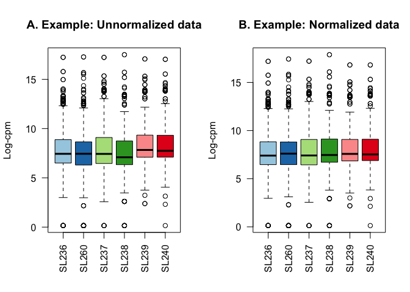
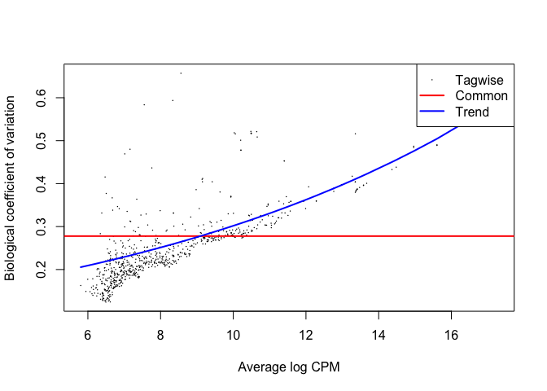
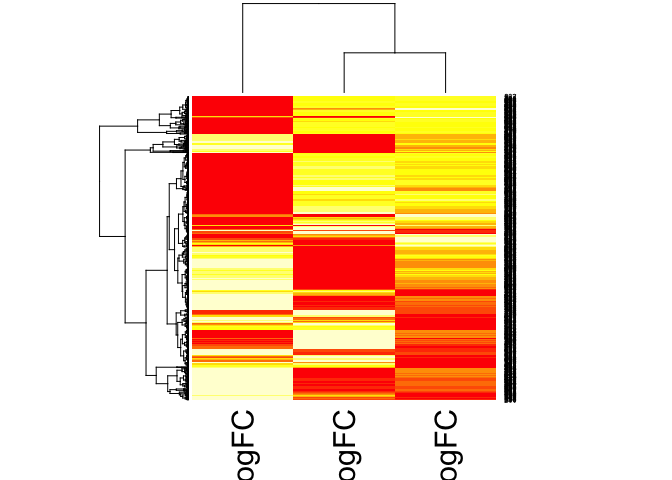
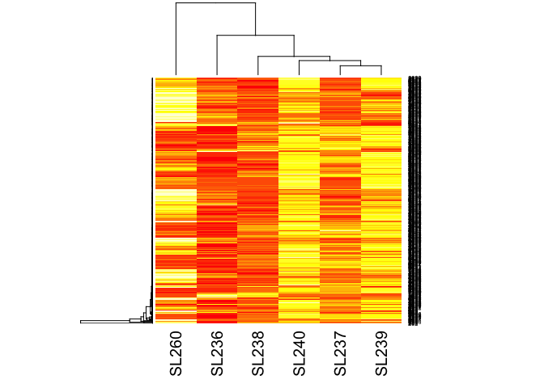
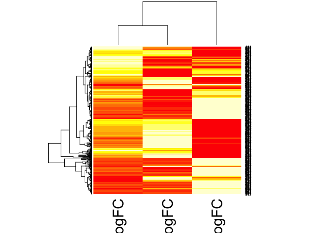
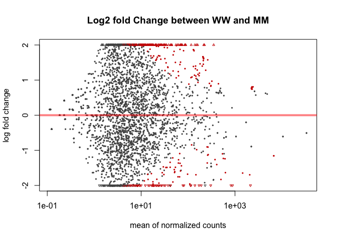
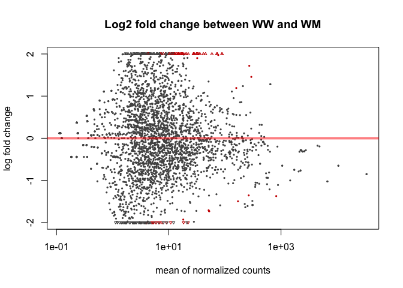
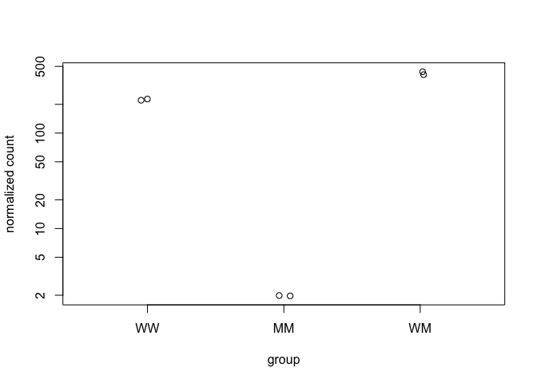
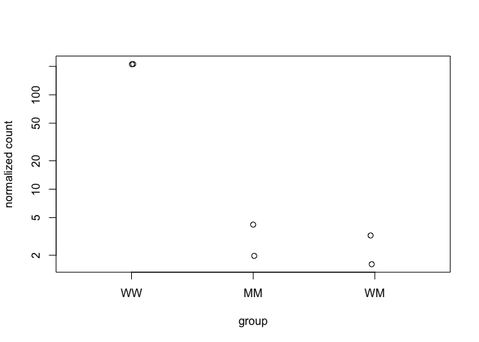
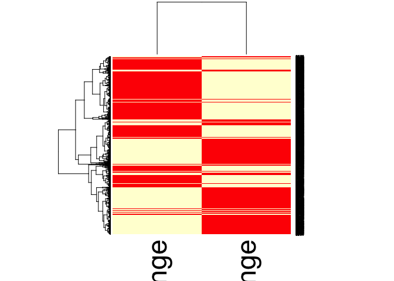

## Analysis Using EdgeR

The Data
--------

The data used in this analysis is from an experiment that extracted small RNA from a series of Arabidopsis grafting experiments. There are three data groups: wild-type shoot grafted onto wild-type root, triple mutant shoot grafted onto triple mutant root, and wild-type shoot grafted onto triple mutant root.

The Goal
--------

The goal of this exercise is to use the R package edgeR to identify and compare small RNA loci that are differentially expressed between the three conditions (wild-type/wild-type; mutant/mutant; wild-type/mutant).

Reading in the Data
-------------------

Load the required library and data for the exercise. You can download the dataset at: <https://bios221.stanford.edu/data/mobData.RData>

``` r
source("http://bioconductor.org/biocLite.R")
biocLite("edgeR")
biocLite("baySeq")
install.packages("dplyr")
```

``` r
library(dplyr)
library(edgeR)
library(baySeq)
load("mobData.RData")
head(mobData)
```

Modifing the Data Table
-----------------------

``` r
#renaming columns 
#MM: triple mutant shoot--triple mutant root
#WM: wild-type shoot--triple mutant root
#WW: wild-type shoot--wild-type root
mobDataGroups <- c("MM","MM", "WM", "WM", "WW", "WW")

data(mobAnnotation)
head(mobAnnotation)
```

    ##   chr start   end
    ## 1   1   789   869
    ## 2   1  8641  8700
    ## 3   1 10578 10599
    ## 4   1 17041 17098
    ## 5   1 17275 17318
    ## 6   1 17481 17527

Data Objects in edgeR
---------------------

edgeR requires a table of integer read counts (read: whole numbers) with rows that correspond to genes and columns that correspond to independent libraries. edgeR stores data in a list-based data object called DGEList. This is then able to be modified like any other list in R. The DGEList stores all of the information in a single variable. We'll use something like **d &lt;- estimateCommonDisp(d)** which we'd think would overwrite the variable, but instead its adding another element to the list.

``` r
d <- DGEList(counts=mobData, group=factor(mobDataGroups))
d
```

    ## An object of class "DGEList"
    ## $counts
    ##   SL236 SL260 SL237 SL238 SL239 SL240
    ## 1    21    52     4     4    86    68
    ## 2    18    21     1     5     1     1
    ## 3     1     2     2     3     0     0
    ## 4    68    87   270   184   396   368
    ## 5    68    87   270   183   396   368
    ## 2995 more rows ...
    ## 
    ## $samples
    ##       group lib.size norm.factors
    ## SL236    MM   152461            1
    ## SL260    MM   309995            1
    ## SL237    WM   216924            1
    ## SL238    WM   208841            1
    ## SL239    WW   258404            1
    ## SL240    WW   276434            1

Data Filtering
--------------

The first step in determining differential gene expression is to remove genes that did not occur frequently. In this example we're only keeping a gene if it has 100 or greater counts per million for at least two samples. After filtering it is a good practice to reset the library sizes.

In edgeR, library size and normalization scaling factors are separated (different from DESeq). lib.size and norm.factors are multiplied together to calculate the effective library size (similar to DESeq's size factor)

``` r
#number of genes: number of columns (samples)
dim(d)
```

    ## [1] 3000    6

``` r
#making a copy in case we mess up
d.full <- d 
head (d$counts)
```

    ##   SL236 SL260 SL237 SL238 SL239 SL240
    ## 1    21    52     4     4    86    68
    ## 2    18    21     1     5     1     1
    ## 3     1     2     2     3     0     0
    ## 4    68    87   270   184   396   368
    ## 5    68    87   270   183   396   368
    ## 6     1     0     6    10     6    12

``` r
#calculating cpm
head(cpm(d))
```

    ##        SL236      SL260       SL237     SL238       SL239     SL240
    ## 1 137.740143 167.744641   18.439638  19.15333  332.812186  245.9900
    ## 2 118.062980  67.743028    4.609909  23.94166    3.869909    3.6175
    ## 3   6.559054   6.451717    9.219819  14.36500    0.000000    0.0000
    ## 4 446.015702 280.649688 1244.675555 881.05305 1532.484017 1331.2400
    ## 5 446.015702 280.649688 1244.675555 876.26472 1532.484017 1331.2400
    ## 6   6.559054   0.000000   27.659457  47.88332   23.219455   43.4100

``` r
#total gene counts per sample
apply(d$counts, 2, sum)
```

    ##  SL236  SL260  SL237  SL238  SL239  SL240 
    ## 152461 309995 216924 208841 258404 276434

``` r
#keeping genes with greater than 100 cpm in at least 2 samples
keep <- rowSums(cpm(d)>100) >=2
d <- d[keep,]

#number of genes remaining: number of columns remaining
dim(d)
```

    ## [1] 724   6

``` r
#reset the library sizes after filtering
d$samples$lib.size <- colSums(d$counts)
d$samples
```

    ##       group lib.size norm.factors
    ## SL236    MM   145153            1
    ## SL260    MM   294928            1
    ## SL237    WM   207227            1
    ## SL238    WM   200563            1
    ## SL239    WW   242628            1
    ## SL240    WW   259990            1

Figure comparing Raw and Filtered Data
======================================

Figure shows the density of log-CPM values for raw pre-filtered data (A, d.full) and post-filtered data (B, d). Dashed line represents a CPM of 1.

``` r
library(RColorBrewer)
nsamples <- ncol(d.full)
col <- brewer.pal(nsamples, "Paired")
dcpm <- cpm(d.full, log=TRUE)
par(mfrow=c(1,2))
plot(density(dcpm[,1]), col=col[1], lwd=2, ylim=c(0,0.40), las=2, 
     main="", xlab="")
title(main="A. Raw data", xlab="Log-cpm")
abline(v=0, lty=3)
for (i in 2:nsamples){
  den <- density(dcpm[,i])
  lines(den$x, den$y, col=col[i], lwd=2)
}
legend("topright", mobDataGroups, text.col=col, bty="n")
lcpm <- cpm(d, log=TRUE)
plot(density(lcpm[,1]), col=col[1], lwd=2, ylim=c(0,0.40), las=2, 
     main="", xlab="")
title(main="B. Filtered data", xlab="Log-cpm")
abline(v=0, lty=3)
for (i in 2:nsamples){
  den <- density(lcpm[,i])
  lines(den$x, den$y, col=col[i], lwd=2)
}
legend("topright", mobDataGroups, text.col=col, bty="n")
```


Data Normalization
------------------

edgeR normalizes data by total count. edgeR is to be used for differential expression analysis, not the quantification of expression levels. It determines relative changes in expression levels between conditions, not absolute expression levels. Code makes a boxplot of the log-CPM values showing expression distributions for unnormalized (A) and normalized data (B).

``` r
par(mfrow=c(1,2))
lcpm <- cpm(d, log=TRUE)
boxplot(lcpm, las=2, col=col, main="")
title(main="A. Example: Unnormalized data",ylab="Log-cpm")

d <- calcNormFactors(d)
d
```

    ## An object of class "DGEList"
    ## $counts
    ##   SL236 SL260 SL237 SL238 SL239 SL240
    ## 1    21    52     4     4    86    68
    ## 4    68    87   270   184   396   368
    ## 5    68    87   270   183   396   368
    ## 7    11    24    21    26    52    55
    ## 8   184   499   404   280   560   426
    ## 719 more rows ...
    ## 
    ## $samples
    ##       group lib.size norm.factors
    ## SL236    MM   145153    1.0284561
    ## SL260    MM   294928    0.8947244
    ## SL237    WM   207227    1.0128068
    ## SL238    WM   200563    0.7695941
    ## SL239    WW   242628    1.1946131
    ## SL240    WW   259990    1.1671034

``` r
lcpm <- cpm(d, log=TRUE)
boxplot(lcpm, las=2, col=col, main="")
title(main="B. Example: Normalized data",ylab="Log-cpm")
```



Data Exploration
----------------

Multi-dimensional scaling (MDS) plots show the relationship between samples. Similar samples are near each other, while samples that are dissimilar are apart from one another.

``` r
plotMDS(d, method="bcv", col=as.numeric(d$samples$group))
legend("bottomleft", as.character(unique(d$samples$group)), col=1:3, pch=20)
```


Estimating the Dispersion
-------------------------

This is the first major step in the analysis of differential gene expression data. The dispersion parameter is a measure of the inter-library variation for that tag. This gives the program an idea of what normal variability in a sample is like so it can better identify differentially expressed genes. In this example, we are assuming that all tags have the same dispersion.

``` r
d1 <-estimateCommonDisp(d, verbose=T)
```

    ## Disp = 0.07776 , BCV = 0.2789

``` r
names(d1)
```

    ## [1] "counts"            "samples"           "common.dispersion"
    ## [4] "pseudo.counts"     "pseudo.lib.size"   "AveLogCPM"

``` r
#empirical Bayes tagwise dispersion calcualtion. Common dispersion needs to be estimated before tagwise dispersion

d1 <- estimateTagwiseDisp(d1)
names(d1)
```

    ##  [1] "counts"             "samples"            "common.dispersion" 
    ##  [4] "pseudo.counts"      "pseudo.lib.size"    "AveLogCPM"         
    ##  [7] "prior.df"           "prior.n"            "tagwise.dispersion"
    ## [10] "span"

Plotting the biological coefficient of variation
------------------------------------------------

The tagwise biological coefficient of variation (BCV) is the square root of the dispersions. plotBCV() plots the BCV against log2-CPM. This plot shows that making the assumption that all samples had the same dispersion is incorrect. Tagwise dispersion does not follow the model, but instead increases as counts per million increases.

``` r
plotBCV(d1)
```


GLM Estimates of Dispersion
---------------------------

This applies a generalized linear model fit to the common and tagwise dispersion. The BCV value changes from before because we modeled the tagwise dispersion based on the chosen glm model.

``` r
design.mat <- model.matrix(~ 0 + d$samples$group)
colnames(design.mat) <- levels(d$samples$group)
d2 <- estimateGLMCommonDisp(d, design.mat)
#method options for GLM trends--"auto", "bin.spline", "power", "bin.loess"
d2 <- estimateGLMTrendedDisp(d2, design.mat, method="power")
d2 <- estimateGLMTagwiseDisp(d2, design.mat)
plotBCV(d2)
```



Differential Expression
-----------------------

Once you've calculated the dispersion, you can move forward with determining differential expression. edgeR uses the exact negative binomial test to conduct tagwise tests. You can visualize the most significant tags using topTags().

``` r
#this set of code uses d1--the naive method with only a common dispersion
#you can only compare two groups at a time
#comparing groups 1 (MM) and 2 (WM)
et12 <- exactTest(d1, pair=c(1,2))

#comparing groups 1 (MM) and 3 (WW)
et13 <- exactTest(d1, pair=c(1,3))

#comparing groups 2 (WM) and 3 (WW)
et23 <- exactTest(d1, pair=c(2,3))

#topTags(et12, n=10)
#topTags(et13, n=10)
#topTags(et23, n=10)

#differentially expressed genes at a false discovery rate < 0.05
de1 <- decideTestsDGE(et12, adjust.method="BH", p.value=0.05)
#-1 = downregulated, 0 = non-differentially expressed, 1= upregulated
summary(de1)
```

    ##    [,1]
    ## -1  140
    ## 0   436
    ## 1   148

``` r
#plotSmear plots tagwise log-fold-changes against log-cpm. DE tags are highlighted on the plot
de1tags12 <- rownames(d1)[as.logical(de1)]
plotSmear(et12, de.tags=de1tags12)
abline(h = c(-2,2), col= "blue")
```


GLM and Differential Expression
-------------------------------

Using a likelihood ratio test to find differentially expressed genes

``` r
#this set of code uses d2--the glm calculated BCV
design.mat
```

    ##   MM WM WW
    ## 1  1  0  0
    ## 2  1  0  0
    ## 3  0  1  0
    ## 4  0  1  0
    ## 5  0  0  1
    ## 6  0  0  1
    ## attr(,"assign")
    ## [1] 1 1 1
    ## attr(,"contrasts")
    ## attr(,"contrasts")$`d$samples$group`
    ## [1] "contr.treatment"

``` r
fit <- glmFit(d2, design.mat)
#you can only compare two groups at a time
#comparing groups 1 (MM) and 2 (WM)
lrt12 <- glmLRT(fit, contrast=c(1, -1, 0))
#comparing groups 1 (MM) and 3 (WW)
lrt13 <- glmLRT(fit, contrast=c(1,0,-1))
#comparing groups 2 (WM) and 3 (WW)
lrt23 <- glmLRT(fit, contrast=c(0,1,-1))

topTags(lrt12, n=10)
```

    ## Coefficient:  1*MM -1*WM 
    ##           logFC   logCPM        LR       PValue          FDR
    ## 1717  -7.940313 9.983895 137.29913 1.037219e-31 7.509465e-29
    ## 74   -10.663209 9.120868 124.67026 6.009523e-29 2.175447e-26
    ## 1111  -9.903262 8.359566 116.49191 3.708887e-27 8.950781e-25
    ## 1334  -9.844242 8.157813 115.81279 5.223508e-27 9.454550e-25
    ## 625    7.445548 8.224665 104.94947 1.252903e-24 1.814203e-22
    ## 1353  -9.265860 7.693619  97.65123 4.989604e-23 6.020789e-21
    ## 2322  -5.182636 8.662524  94.82371 2.081174e-22 2.152529e-20
    ## 2537   5.008245 8.778375  94.10169 2.997229e-22 2.712492e-20
    ## 1696  -8.933420 7.306297  85.07723 2.869353e-20 2.308235e-18
    ## 764   -9.242198 7.782935  84.24614 4.368566e-20 3.162842e-18

``` r
topTags(lrt13, n=10)
```

    ## Coefficient:  1*MM -1*WW 
    ##           logFC   logCPM        LR       PValue          FDR
    ## 490   -6.116142 8.541820 122.88815 1.475358e-28 1.068159e-25
    ## 74   -10.426218 9.120868 117.53796 2.188704e-27 7.923109e-25
    ## 1717  -7.131777 9.983895 111.35563 4.945390e-26 1.193487e-23
    ## 1111  -9.625056 8.359566 107.37515 3.683976e-25 6.667996e-23
    ## 1027   5.257532 6.421199  97.56969 5.199371e-23 7.528689e-21
    ## 1334  -9.230074 8.157813  94.06834 3.048153e-22 3.678105e-20
    ## 1528  -5.069486 8.520478  91.99614 8.684576e-22 8.982333e-20
    ## 1963   6.420110 6.954254  89.57115 2.958063e-21 2.677047e-19
    ## 1353  -8.873376 7.693619  85.26993 2.602918e-20 2.093903e-18
    ## 764   -9.092243 7.782935  81.16124 2.080327e-19 1.506157e-17

``` r
topTags(lrt23, n=10)
```

    ## Coefficient:  1*WM -1*WW 
    ##          logFC   logCPM        LR       PValue          FDR
    ## 490  -6.863443 8.541820 127.57124 1.393093e-29 1.008599e-26
    ## 241  -5.582518 7.898382  93.23794 4.637064e-22 1.678617e-19
    ## 1202 -6.003759 6.567613  77.59254 1.266475e-18 3.056426e-16
    ## 625  -6.475002 8.224665  72.09166 2.054305e-17 3.718292e-15
    ## 1791 -5.446363 8.829660  71.05702 3.470483e-17 5.025260e-15
    ## 489  -8.273646 6.385658  70.31246 5.061705e-17 6.107791e-15
    ## 2934 -3.726997 8.550568  68.26249 1.431176e-16 1.480245e-14
    ## 2106 -4.867999 7.241542  64.57986 9.269785e-16 8.389155e-14
    ## 2537 -4.146776 8.778375  63.59273 1.529927e-15 1.230741e-13
    ## 1810 -4.463342 7.739858  52.99695 3.340663e-13 2.418640e-11

``` r
de2 <- decideTestsDGE(lrt12, adjust.method="BH", p.value=0.05)
de2tags12 <- rownames(d2)[as.logical(de2)]
plotSmear(lrt12, de.tags=de2tags12)
abline(h= c(-2,2), col="blue")
```


Creating a Venn Diagram
-----------------------

Building a Venn Diagram to compare differentially expressed genes between the three conditions.

``` r
de2 <- decideTestsDGE(lrt12, adjust.method="BH", p.value=0.05)
de3 <- decideTestsDGE(lrt13, adjust.method="BH", p.value=0.05)
de4 <- decideTestsDGE(lrt23, adjust.method="BH", p.value=0.05)

library(limma)
de5 <- cbind(de2, de3, de4)
v <- vennCounts(de5)
v
```

    ##   Group 1 Group 2 Group 3 Counts
    ## 1       0       0       0    312
    ## 2       0       0       1     16
    ## 3       0       1       0     62
    ## 4       0       1       1     26
    ## 5       1       0       0     49
    ## 6       1       0       1     37
    ## 7       1       1       0    194
    ## 8       1       1       1     28
    ## attr(,"class")
    ## [1] "VennCounts"

``` r
vennDiagram(v)
```


Creating a Heatmap logfc data
=============================

``` r
et12df <- data.frame(et12$table)
et12logfc <- data.frame(et12df$logFC)

et13df <- data.frame(et13$table)
et13logfc <- data.frame(et13df$logFC)

et23df <- data.frame(et23$table)
et23logfc <- data.frame(et23df$logFC)

z <- cbind(et13logfc, et23logfc, et12logfc)

hmz <- data.matrix(z)
heatmap(hmz)
```



``` r
#heatmap of counts
hm_matrix <- data.matrix(d$counts)
heatmap(hm_matrix)
```



``` r
lrt12 <- glmLRT(fit, contrast=c(1, -1, 0))
lrt13 <- glmLRT(fit, contrast=c(1,0,-1))
lrt23 <- glmLRT(fit, contrast=c(0,1,-1))

lrt12df <- data.frame(lrt12$table)
lrt12logfc <- data.frame(lrt12df$logFC)

lrt13df <- data.frame(lrt13$table)
lrt13logfc <- data.frame(lrt13df$logFC)

lrt23df <- data.frame(lrt23$table)
lrt23logfc <- data.frame(lrt23df$logFC)

lrt123 <- cbind(lrt13logfc, lrt23logfc, lrt12logfc)

hm_lrt123 <- data.matrix(lrt123)
heatmap(hm_lrt123)
```



Reference: web.stanford.edu/class/bios221/labs/rnaseq/lab\_4\_rnaseq.html

Analysis Using DESeq2
=====================

Theory
------

Differential sequence analysis with DESeq uses a generalized linear model, where counts for a gene in a sample are modeled with a negative binomial distribution with fitted mean and a gene specific dispersion parameter. The fitted mean is calculated by multiplying sample specific size factors and a parameter proportional to the "expected true concentrations of fragments". Dispersions are estimated from expected mean values from the maximum likelihood estimate of log2 fold changes.

Summary: DESeq2 relies on negative binomial distribution to make estimates, and uses Cook's distance to estimate how much fitted coefficients change if samples are removed.

The Data
--------

For the purposes of comparison, the same dataset will be used in DESeq2 analysis as in edgeR differential expression analysis. Both programs require a matrix input of raw count data in the form of integer values (unnormalised and unprocessed prior to use).

Load library and mobData
------------------------

``` r
biocLite("DESeq2")
install.packages("data.table")
```

``` r
library(DESeq2)
library(data.table)
```

Data objects in DESeq2
----------------------

Like edgeR, DESeq2 has its own list-based object, which stores read counts, called a DESeqDataObject(). Unlike edgeR, this object includes an associated design formula for the downstream data analysis with the DESeq() function. The design formula tells the DESeq() function which variables will be used in modeling. It uses a tilde (~), followed by the variables with plus signs between them. This formula can be later changed, but afterward all analysis steps must be repeated because the formula is used to estimate dispersion and log2 fold changes.

For use with a count matrix, the function DESeqDataSetFromMatrix() should be used. For this function you should provide the counts matrix, the column information as a DataFrame or data.frame and the design formula.

*NOTE*: Always put the variable of interest at the end of the formula and make sure the control level is the first level.

Load the data
-------------

``` r
load("mobData.RData")
head(mobData)
```

    ##      SL236 SL260 SL237 SL238 SL239 SL240
    ## [1,]    21    52     4     4    86    68
    ## [2,]    18    21     1     5     1     1
    ## [3,]     1     2     2     3     0     0
    ## [4,]    68    87   270   184   396   368
    ## [5,]    68    87   270   183   396   368
    ## [6,]     1     0     6    10     6    12

Prepare the count matrix and metadata table
-------------------------------------------

``` r
MobCountData <- as.matrix(mobData) #DESeq object only takes a matrix

#Create column metadata table
MobColData <- matrix(c("MM",'SL236',"MM",'SL260',"WM", 'SL237', "WM", 'SL238', "WW",'SL239', "WW",'SL240'), ncol=2, byrow=TRUE) 
rownames(MobColData) <- c('SL236','SL260','SL237','SL238','SL239','SL240')
colnames(MobColData) <- c('condition', 'experiment')
MobColData <- as.data.frame(MobColData)

#Check that rownames and column names match in both colData and countData
all(rownames(MobColData) %in% colnames(MobCountData))  #Should return TRUE
```

    ## [1] TRUE

``` r
all(rownames(MobColData) == colnames(MobCountData))    
```

    ## [1] TRUE

``` r
# should return TRUE
```

Relevel condition to put the wild-type controls at the top
----------------------------------------------------------

It is important to supply levels (otherwise the levels are chosen in alphabetical order) and to put the *control* or *untreated* level as the first element ("base level"), so that the log2 fold changes produced by default will be the expected comparison against the base level. An R function for easily changing the base level is relevel.

``` r
#Give the condition column levels
MobColData$condition <- factor(MobColData$condition)
levels(MobColData$condition) #check to see that it has levels
```

    ## [1] "MM" "WM" "WW"

``` r
#Relevel to make sure that control is the first level in the treatment factor for each
MobColData$condition  <- relevel(MobColData$condition, "WW")
```

Construct DESeqDataSetFromMatrix
--------------------------------

Unlike edgeR where we needed to perform individual contrasts for each variable we want to compare, using the DESeq formula you can tell it the variable that models will be run with, and then later when manipulating the *Results* object you will pull out the comparisons you want.

``` r
ddsMob <- DESeqDataSetFromMatrix(countData = MobCountData,
colData = MobColData,
design = ~ condition)
```

For experiments with more replicates, DESeq2 can handle collapsing technical replicates. A wide variety of design formulas are possible here depending on the complexity of the experiment.

Filter out genes with low counts
--------------------------------

Typically don't need to pre-filter because independent filtering occurs within results() to save you from multiple test correction on genes with no power. The main reason to pre-filter would be to increase speed. Designs with many samples and many interaction terms can slow down on genes which have very few reads.

Normalization
-------------

In DESeq2 normalization of read counts is computed within the first built-in step of the DESeq2 function, estimateSizeFactors. No manual count normalization to RPKM or FPKM is required.

Differential Expression Analysis
--------------------------------

Standard steps to perform differential expression analysis are all rolled into a single function in DESeq2, unlike in edgeR where these steps are performed manually in a sequence. These steps can be performed manually, however, in DESeq2 if the user prefers. For experiments with a larger number of samples parallelized computing can be used.

Main steps of the DESeq2 function: 1. estimation of size factors (s) by estimateSizeFactors 2. estimation of dispersion (a) by estimateDispersions 3. negative binomial GLM fitting for (B) and Wald statistics by nbinomWaldTest

``` r
ddsMob <- DESeq(ddsMob)
```

    ## estimating size factors

    ## estimating dispersions

    ## gene-wise dispersion estimates

    ## mean-dispersion relationship

    ## final dispersion estimates

    ## fitting model and testing

Results are extracted using the function *results()*. This function extracts a results table with log2 fold changes, p values and adjusted p values. Supply arguments to results to extract the comparisons you wish to make.

``` r
mobResWM <- results(ddsMob, contrast = c("condition", "WW", "WM"))
mobResMM <- results(ddsMob, contrast=c("condition", "WW", "MM"))
```

Preliminary analysis
--------------------

Summarize results using the *summary()* function.

``` r
summary(mobResWM)
```

    ## 
    ## out of 2945 with nonzero total read count
    ## adjusted p-value < 0.1
    ## LFC > 0 (up)     : 52, 1.8% 
    ## LFC < 0 (down)   : 18, 0.61% 
    ## outliers [1]     : 0, 0% 
    ## low counts [2]   : 1084, 37% 
    ## (mean count < 4)
    ## [1] see 'cooksCutoff' argument of ?results
    ## [2] see 'independentFiltering' argument of ?results

``` r
summary(mobResMM)
```

    ## 
    ## out of 2945 with nonzero total read count
    ## adjusted p-value < 0.1
    ## LFC > 0 (up)     : 219, 7.4% 
    ## LFC < 0 (down)   : 107, 3.6% 
    ## outliers [1]     : 0, 0% 
    ## low counts [2]   : 1141, 39% 
    ## (mean count < 4)
    ## [1] see 'cooksCutoff' argument of ?results
    ## [2] see 'independentFiltering' argument of ?results

Order the results tables by their adjusted pvalue.

``` r
mobResMMOrdered <- mobResMM[order(mobResMM$padj),]
head(mobResMMOrdered)
```

    ## log2 fold change (MAP): condition WW vs MM 
    ## Wald test p-value: condition WW vs MM 
    ## DataFrame with 6 rows and 6 columns
    ##    baseMean log2FoldChange     lfcSE      stat       pvalue         padj
    ##   <numeric>      <numeric> <numeric> <numeric>    <numeric>    <numeric>
    ## 1 216.35016       6.326480 0.6443122  9.818968 9.329371e-23 1.683019e-19
    ## 2 159.77453       3.976800 0.4147114  9.589320 8.866707e-22 7.997770e-19
    ## 3  71.68716       5.799277 0.6534014  8.875519 6.960783e-19 3.189259e-16
    ## 4 112.71103      -3.847292 0.4335582 -8.873763 7.071527e-19 3.189259e-16
    ## 5 303.58163      -3.364301 0.3957665 -8.500720 1.884177e-17 6.798112e-15
    ## 6 116.67663       6.933205 0.8295799  8.357490 6.406682e-17 1.926276e-14

``` r
mobResWMOrdered <- mobResWM[order(mobResWM$padj),]
```

Exploring results
-----------------

MA plots
========

The function plotMA shows the log2 fold changes attributable to a given variable over the mean of normalized counts. Points will be colored red if the adjusted p value is less than 0.1. Points which fall out of the window are plotted as open triangles pointing either up or down.

``` r
plotMA(mobResMM, main="Log2 fold Change between WW and MM", ylim=c(-2,2))
```



``` r
plotMA(mobResWM, main="Log2 fold change between WW and WM", ylim=c(-2,2))
```



Plotcounts
==========

To examine the counts of reads for a single gene across the groups use *plotCounts()*, which normalizes counts by sequencing depth and adds a pseudocount of 1/2 to allow for log scale plotting. The counts are grouped by the variables in intgroup, where more than one variable can be specified. Here we specify the gene which had the smallest p-value from the results table created above. You can select the gene to plot by rowname or by numeric index.

``` r
plotCounts(ddsMob, gene=which.min(mobResMM$padj), intgroup="condition")
```



``` r
plotCounts(ddsMob, gene=which.min(mobResWM$padj), intgroup="condition")
```



Heatmaps of Log2FC
------------------

``` r
mobResWMdf <- data.frame(mobResWM)
mobResMMdf <- data.frame(mobResMM)
mobResWMdf_log2FC <- data.frame(mobResWM$log2FoldChange)
mobResMMdf_log2FC <- data.frame(mobResMM$log2FoldChange)
combined_mobRes <- cbind(mobResMMdf_log2FC,mobResWMdf_log2FC)

combined_mobRes <- na.omit(combined_mobRes) 
combined_mobRes_matrix <- data.matrix(combined_mobRes)
heatmap(combined_mobRes_matrix)
```



Similarities and Differences between DESeq2 and edgeR, and which one should I choose?
-------------------------------------------------------------------------------------

As told by Michael Love, a co-creator of DESeq2: 1. Both use a GLM framework to shrink dispersion estimates toward a central value

1.  Both typically report overlapping gene sets

2.  1.  If you have many samples (overll 100) use limma-voom for increased speeds.

3.  Differences in default settings -DESeq2: finds an optimal value at which to filter low count genes, flags or removes genes with large outlier counts or removes when there are enough samples per group (n&gt;6), excludes from the estimation of the dispersion prior and dispersion moderation those genes with very high within-group variance, and moderates log fold changes which have small statistical support (e.g. from low count genes)." -edgeR: Similar functionality. "It offers a robust dispersion estimation function, estimateGLMRobustDisp, which reduces the effect of individual outlier counts, and a robust argument to estimateDisp so that hyperparameters are not overly affected by genes with very high within-group variance. And the default steps in the edgeR User Guide for filtering low counts genes both increases power by reducing multiple testing burden and removes genes with uninformative log fold changes."

4.  edgeR and DESeq2 perform more similarly to each other than either does to limma-voom. The GLM methods in edgeR and the quasi-likelihood (QL) methods in edgeR are more different than comparing edgeR to DESeq2.

5.  Limma-voom and the QL functions in edgeR do better at always being under the nominal FDR, although they can have reduced sensitivity compared to DESeq2 and edgeR when the sample sizes are small (n=3 per group), or fold changes and counts are small.

Conclusion
----------

Both methods are good for gene-level DE analysis, often find overlapping gene sets. For small experiments (n&lt;6) DESeq2 may be more appropriate than edgeR. For very large experiments (n&gt;100) limma-voom may be a more appropriate option.

References
----------

Reference: Differential analysis of count data - the DESeq2 package Michael Love, Simon Anders, Wolfgang Huber, Department of Biostatistics, Dana Farber Cancer Institute and Harvard School of Public Health, Boston, US; European Molecular Biology Laboratory (EMBL), Heidelberg, Germany. December 16, 2014 Klaus, Bernd. 2014."Differential expression analysis of RNA-Seq data using DESeq2". European Molecular Biology Laboratory (EMBL). Heidelberg, Germany.

<https://mikelove.wordpress.com/2016/09/28/deseq2-or-edger/>
